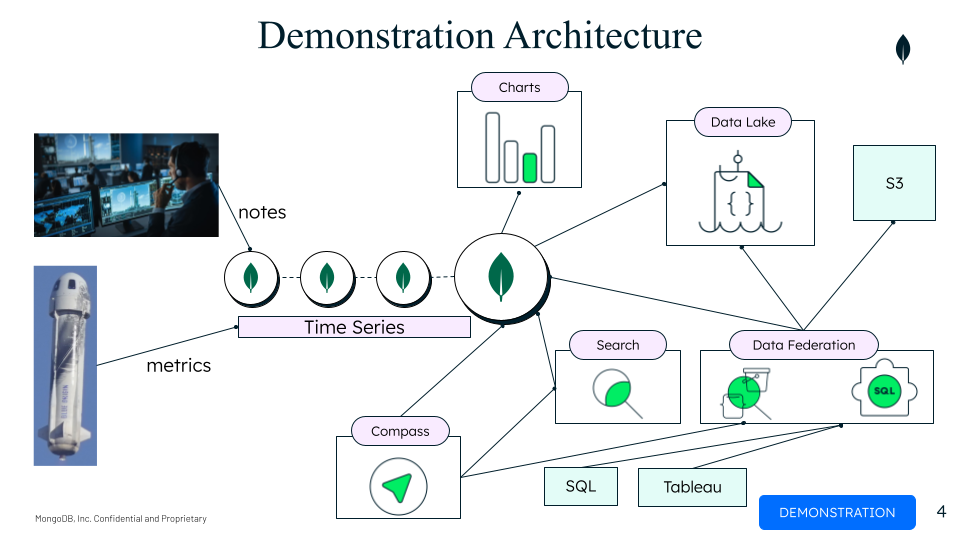

# MONGODB DEVELOPER DATA PLATFORM ROCKET DEMO

This demonstration shows how the various components of MongoDB's
Developer Data Platform (DDP) can be used together to support real-time
analytics. It uses an open source data set from a Blue Origin launch
along with some made up data.

The demonstration shows how a company could use MongoDB Atlas to
manage and perform analytics on the data generated during a rocket
launch. A typical rocket launch spans an eight hour period from the
time the initial countdown begins until the rocket payload is in
orbit. During this eight hour window, approximately 1 million metrics
are generated per second by sensors capturing the rocket
performance. 

While the metrics make up the bulk of the data in this scenario, there
are two other sources of data: notes and weather data. Notes are
created by both rocket engineers and an automated system. The rocket
engineers create notes when they want to mark a time period or
situation that they want to remember to revisit after the launch has
been completed. An automated system (implemented as Atlas triggers) is
continuously watching the parameters as they stream in and creates
notes whenever parameters reach thresholds that are out of
bounds. Weather data is stored in a S3 bucket and analyzed in
combination with the launch data post launch.

The demonstrate consists of 4 parts (or acts):

1. Atlas Cluster and Data
   Demonstration of Atlas, the Atlas cluster deployed for the
   demonstration, and overview of the document model for two main
   Atlas collections used to store the launch data: launchData and notes.
2. Real-time analytics
   Demonstration of how MongoDB can be used to perform real-time
   analytics on the data during launch. 
    * Compass is used to review a number of aggregation queries on the launch data and notes
      collections. 
    * A charts dashboard is displayed to show how Charts visualizations can
	  be created to analyze the same data
3. Search analytics
   This section of the demonstration focuses on two areas:
    * How Atlas Search can be used for analytics (facet
      counts associated with search queries)
	* How various DDP platform can be used in combination. This is
      shown by showing a simple react app that supports Atlas search
      with faceted navigation in combination with Charts. Entering a
      search phrase, selecting facets, and clicking on search results
      (notes) updates the time range for the charts shown in the
      previous step to the time context of the selected note.
4. Post launch analytics over a variety of MongoDB and non-MongoDB
   data sources.
   This section shows how Atlas Data Lake, Data Federation, and Atlas
   SQL can be used to analyze data post launch. Data is pulled from
   three data sources: Atlas cluster, Atlas Data Lake, and Data
   Federation. Data Lake is configured to take daily snapshots of the
   Atlas cluster so it has a historical record of previous
   launches. Data Federation is used to create a federated endpoint
   that allows for the combined analysis of the current launch,
   historical launches along with the weather data stored in
   S3. During the demo, this data is analyzed using Compass (MQL),
   DBeaver (SQL), and Tableau.
   
Atlas Search
Compass
Demo App
4. Data Federation, Data Lake, & Atlas SQL
Compass
S3
SQL Client
Tableau




# DEMO SETUP

## Atlas Configuration

The Atlas configuration components consist of:

1. M30 replica set plus a M50 analytics node
2. Data Lake pipeline to archive the aerospace database, launchData collection
3. Data Federation configuration combining three data sources:
  * Atlas cluster
  * Data Lake
  * S3 bucket with weather data
4. Charts Dashboard to review launch data
5. Triggers to generate notes for out of bound parameters (the code for this is fake, e.g., doesn't really work)
6. Atlas Search indexes to facilitate the note search and corresponding facets.
7. Atlas Search/Charts React App [app](https://runkel-rfv-demo-tyypa.mongodbstitch.com), [github](https://github.com/ranfysvalle02/reactivesearch-mdb)
8. Tableau connected to the Data Federation Endpoint using Tableau connector
9. DBeaver to execute SQL queries against the Data Federation Endpoint
   (Atlas SQL).
  

## Atlas Cluster Data
There are two main collections used in the demo:

* launchData
* notes

This data can be found in the file ~/data/atlas/aerospace.archive.gz

```mongorestore --uri $CONNECTION_STR --username $DBUSER --password $DBUSER_PASS --gzip --archive=./data/atlas/aerospace.archive.gz```

## Data Federation Configuration

The configuration for the data federation can be found in the dataFederationConfiguration.json file.

The following schema files were created for Atlas SQL:

- Data Lake schema: dLakeLaunchDataSchema.json
- Schema for S3 bucket: s3SolarWindSchema.json

Use sqlSetSchema to update the schemas

## S3

The S3 bucket contains a single folder called SolarWinds. The contents of this folder are all the files found in the json files found in the ~/Data/solar-wind/json directory plus the SolarWindAll_2020_10_13.json file. The SolarWindAll_2020_10_13.json file contains all the same documents as the ~/Data/solar-wind/json directory, but the dates in the all.json file are set to match the launchData.


## Tableau
Load the LaunchDayPlasma.twb workspace into Tableau

To set up the Tableau connector use the combination of the Federated Endpoint URI plus the database name defined in the Data Federation Endpoint connection configuration. Don't use "myFederatedDatabase".

## Compass

The following aggregation queries should be loaded into Compass

1. Atlas Cluster -> aerospace database -> launchData collection
   * ReadingCountsByDevice
   * rollingWindowCalc
2. Atlas Cluster -> aerospace database -> notes collection
   * searchMetaFacets
   * Data Near Bounds
3. Data Lake -> launchData collection
   * ReadingCountByDevice

## Charts Dashboard


## Atlas Search/Charts Search Analytics React App

[Github repository](https://github.com/ranfysvalle02/reactivesearch-mdb)

1. Clone the repository
2. Deploy as App Services application using Realm-Cli
3. Configure:
   - DB Connection information
   - Charts dashboard

# DEMO SCRIPT

See this [google drive](https://docs.google.com/presentation/d/1dNBiLadWn2thuiVTlG62leawAoE-QEDBHUJlMr-7fSo/edit?usp=sharing) deck for a set of slides summarizing the demo and providing a screenshot of each demo step.

